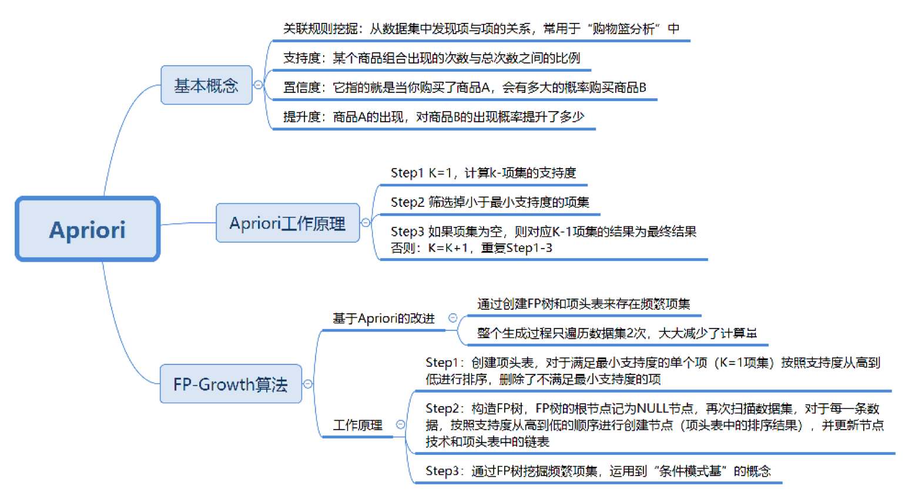

# Apriori
Apriori算法实例-挖掘电影导演的关联规则

# Apriori 概念

关于支持度、置信度和提升度

**支持度**指的是某个商品组合出现的次数与总次数之间的比例。支持度越高，代表这个组合出现的概率越大。

**置信度**是一个条件概念，就是在 A 发生的情况下，B 发生的概率是多少。

**提升度**代表的是“商品 A 的出现，对商品 B 的出现概率提升了多少”。

提升度 (A→B)= 置信度 (A→B)/ 支持度 (B)

# Apriori 的工作原理

Apriori 算法其实就是查找频繁项集 (frequent itemset) 的过程。

1）K=1，计算支持度

2）筛选小于最小支持度的项集

3）判断如果项集项集为空，K-1项集为最终结果

4）判断失败，K=K+1，重复1-3

# FG-Growth算法

(https://www.cnblogs.com/zhengxingpeng/p/6679280.html)[FG-Growth算法]
